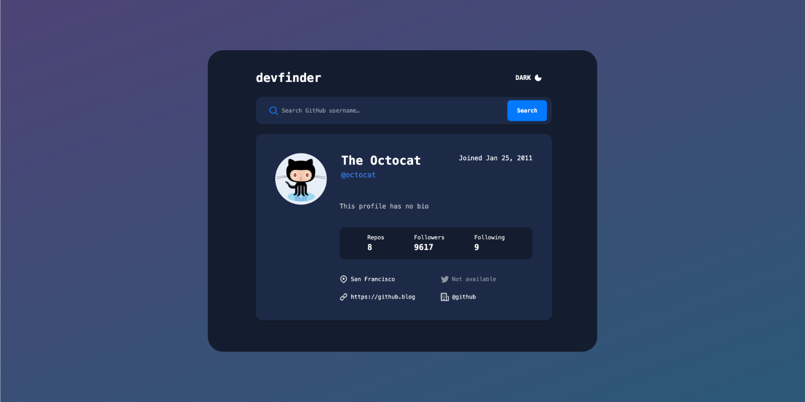

# Frontend Mentor - GitHub user search app solution

This is a solution to the [GitHub user search app challenge on Frontend Mentor](https://www.frontendmentor.io/challenges/github-user-search-app-Q09YOgaH6). Frontend Mentor challenges help you improve your coding skills by building realistic projects.

> [🔗 See it live on GitHub Pages](https://victorseara.github.io/devfinder/)

## Stack

- Vue
- TailwindCSS
- Vite
- Vitest
